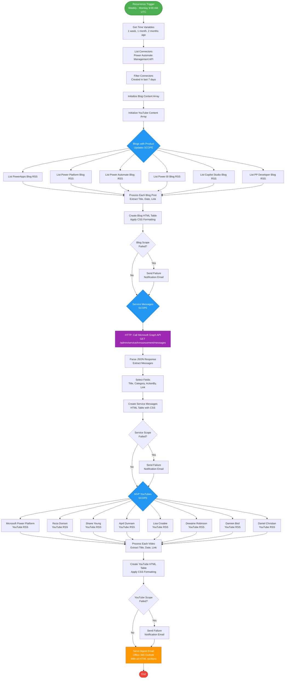

# Power Platform Copilot Studio News Automation

## The Problem This Solves

Staying current with rapidly evolving technologies requires checking dozens of blogs, documentation sites, YouTube channels, and service announcements daily. This becomes overwhelming and time-consuming, leading to missed updates, overlooked features, and reactive rather than proactive learning.

This automation solution eliminates the manual effort by automatically aggregating content from multiple sources into a single digest email. While this template focuses on Power Platform and Copilot Studio, **the pattern works for any technology stack**. You can:

- **Monitor any blog with an RSS feed** - Even if a site doesn't advertise its RSS feed, you can discover it using browser developer tools (F12 in Edge/Chrome, search page source for "rss" or "feed")
- **Pull from any public API** - Microsoft Release Planners, Azure Resource Graph, GitHub releases, StackOverflow tags, or custom APIs
- **Customize for your needs** - Technology vendors, product teams, DevOps monitoring, competitive intelligence, or learning & development programs

This template demonstrates the pattern with Power Platform sources, but the same approach applies to React, Python, Azure, AWS, Kubernetes, or any other technology ecosystem.

## Overview

This Power Automate flow automatically collects and summarizes the latest Power Platform news, updates, and content from multiple sources, then sends a weekly digest email. It monitors blogs, YouTube channels, service announcements, and new connectors to keep you informed about everything happening in the Power Platform ecosystem.

The flow runs weekly based on your trigger run frequency and compiles:
- **Service Messages** from Microsoft 365 Message Center
- **Blog Posts** from official Power Platform product blogs
- **YouTube Videos** from Microsoft and MVP content creators
- **New Connectors** added to Power Platform

All of this information is formatted into a single HTML email digest.

---

## Installation Instructions

### Step 1: Import the Solution
1. Download the solution as a `.zip` file
2. Sign in to [Power Apps](https://make.powerapps.com)
3. Select your target environment from the environment picker
4. Select **Solutions** from the left navigation. If the item isn't in the side panel, select **...More** and then select **Solutions**
5. On the command bar, select **Import solution**
6. On the **Import a solution** page, select **Browse** to locate the `.zip` file that contains the solution
7. Select **Next**
8. Review the solution information displayed. The solution will be imported as **Unmanaged** by default
9. Configure any connection references if prompted (see Step 3 below)
10. Select **Import** and wait for the import to complete. The solution imports in the background and may take a few moments

### Step 2: Set Up Connections
During or after the import process, you'll be prompted to configure connection references. The flow requires these connections:

1. **RSS** - For reading blog and YouTube feeds
2. **Office 365 Outlook** - For sending email
3. **Power Automate Management** - For listing new connectors
4. **HTTP** (optional) - For calling Microsoft Graph API to retrieve Message Center messages

> **Note:** The HTTP connector is only needed if you want to retrieve Microsoft 365 Message Center messages via Graph API. If you don't have access to an Azure subscription or prefer not to set up Azure AD authentication, you can remove the "Service Messages SCOPE" section from the flow and it will still collect blog posts, YouTube videos, and new connectors.

If a connection doesn't already exist, you'll need to create a new one. Select the connections you want to use and select **Next**.

### Step 3: Configure Environment Variables
After the connections are set, you'll be prompted to enter values for environment variables (if they're not already present):

| Variable Name | Description | Example |
|---------------|-------------|---------|
| **Email Recipient** | Email address to receive the digest | `yourname@company.com` |
| **ClientId** | Azure AD App Registration Client ID (optional) | `00000000-0000-0000-0000-000000000000` |
| **TenantId** | Your Azure/Entra Tenant ID (optional) | `00000000-0000-0000-0000-000000000000` |
| **Secret Key** | Azure AD App Registration Secret (optional) | `your-secret-key-here` |

> **Note:** The ClientId, TenantId, and Secret Key are **only required if you're using the HTTP connector** to retrieve Microsoft 365 Message Center messages or other data from Azure/Microsoft Graph API. If you're not using the Service Messages scope or don't have access to an Azure subscription, you can leave these blank or remove the HTTP connector actions from the flow. You won't see the environment variable configuration screen if values are already present in the solution.

#### Microsoft Graph API Prerequisites

This flow retrieves **Message Center messages** from the [Service Announcement API](https://learn.microsoft.com/graph/api/serviceannouncement-list-messages?view=graph-rest-1.0&tabs=http) using the endpoint:
```
GET https://graph.microsoft.com/v1.0/admin/serviceAnnouncement/messages
```

Your Entra ID app registration must have **read access** to the Microsoft Graph API with the following permission:
- **ServiceMessage.Read.All** (Application permission)

**What's Available:**
The Service Announcement API provides access to various Microsoft 365 service communications:
- **Message Center messages** - Service updates, new features, and planned changes (used by this flow)
- **Service Health issues** - Current service incidents and advisories
- **Service Health overviews** - Overall health status of Microsoft 365 services
- **Planned maintenance** - Scheduled maintenance windows

You can extend this flow to include Service Health data by calling additional endpoints. Learn more in the [serviceAnnouncement resource type documentation](https://learn.microsoft.com/graph/api/resources/serviceannouncement).

**Required Setup:**
1. Create an Azure AD App Registration in your [Azure Portal](https://portal.azure.com/#view/Microsoft_AAD_RegisteredApps/ApplicationsListBlade)
2. Grant the **ServiceMessage.Read.All** API permission (Application type)
3. Admin consent is required for this permission
4. Generate a client secret for authentication

**Important for Testing:**
- Message Center data is only available in production Microsoft 365 tenants with active subscriptions
- For testing purposes, consider using:
  - [Microsoft 365 Developer Subscription](https://developer.microsoft.com/microsoft-365/dev-program) (free for development/testing)
  - A non-production tenant with test data

**Reference Documentation:**
- [List service announcement messages](https://learn.microsoft.com/graph/api/serviceannouncement-list-messages?view=graph-rest-1.0&tabs=http)
- [ServiceUpdateMessage resource type](https://learn.microsoft.com/graph/api/resources/serviceupdatemessage?view=graph-rest-1.0)
- [Microsoft Graph permissions reference](https://learn.microsoft.com/graph/permissions-reference#serviceannouncement-permissions)

#### Additional Data Sources (No Authentication Required)

You can extend this flow to include data from public **Release Planner APIs** that don't require authentication:

- **Power Platform Release Planner** - `https://releaseplans.microsoft.com/api/v1/plans/power-platform`
- **Microsoft 365 Release Planner** - `https://releaseplans.microsoft.com/api/v1/plans/microsoft-365`
- **Azure Release Planner** - `https://releaseplans.microsoft.com/api/v1/plans/azure`
- **Microsoft Fabric Release Planner** - `https://releaseplans.microsoft.com/api/v1/plans/microsoft-fabric`

These public APIs provide structured data about upcoming features, release waves, and product roadmaps. Add HTTP actions to the flow to call these endpoints and include the data in your email digest.

### Step 4: Publish and Turn On the Flow

> **Important:** When you import an unmanaged solution, the changes are imported in a **draft state** and must be published to make them active.

1. After the import completes successfully, open the imported solution
2. If needed, publish all customizations by selecting **Publish all customizations** 
3. Find the flow named **Product News E-mail Automation**
4. Select the flow to open it
5. Select **Turn on** in the command bar
6. The flow will now run automatically every Thursday and Friday at 9:00 AM UTC

---

## How the Flow Works

### Schedule & Timing Variables
- **Trigger:** Designed to run weekly (default schedule can be customized)
- **Time Variables:**
  - Gets dates for 1 week ago (9 days to ensure coverage)
  - Gets dates for 1 month ago
  - Gets dates for 2 months ago (used for filtering content)

### Stage 1: Collect Blog Content

The flow retrieves RSS feeds from these official Power Platform blogs:
- **Power Apps Blog** - Latest Power Apps features and updates
- **Power Automate Blog** - Flow updates and capabilities
- **Power BI Blog** - Business intelligence news
- **Copilot Studio Blog** - Conversational AI updates
- **Power Platform Blog** - General platform news
- **Power Platform Developer Blog** - Technical developer content

For each blog post published in the last week:
- Extracts the title, publication date, and link
- Formats as an HTML table row with title linked to the article
- Adds to the blog content array

### Stage 2: Collect YouTube Content

The flow monitors YouTube channels from these content creators:
- **Microsoft Power Platform** (Official Channel)
- **Reza Dorrani** - Power Platform MVP
- **Shane Young** - Power Platform MVP
- **April Dunnam** - Power Platform MVP
- **Lisa Crosbie** - Power Platform MVP
- **Dewaine Robinson** - Power Platform MVP
- **Damien Bird** - Power Platform MVP
- **Daniel Christian** - Power Platform MVP

For each new video published in the last week:
- Extracts the video title, publication date, and link
- Formats as an HTML table row with title linked to the video
- Adds to the YouTube content array

### Stage 3: Collect Service Messages

The flow calls Microsoft Graph API to retrieve service announcements:
- Authenticates using the provided ClientId, TenantId, and Secret Key
- Retrieves messages from the Microsoft 365 Message Center
- Filters for Power Platform-related services
- Parses JSON response to extract:
  - Message title
  - Category (e.g., Plan for change, Prevent or fix issues)
  - Action required date
  - Link to full message

Formats the data into an HTML table with CSS styling for better readability.

> **Note:** This flow uses an API running on [MSPulse360.app](https://www.mspulse360.app) to display Message Center messages. The site itself provides a wealth of updates and news from Microsoft services across multiple sources. You can modify the link structure in the flow to point to your preferred Message Center viewing experience or API endpoint.

### Stage 4: Find New Connectors

The flow queries Power Automate Management API:
- Lists all connectors in the environment
- Filters for connectors created in the last 7 days
- For each new connector:
  - Extracts the connector name and creation date
  - Formats as an HTML table row

### Stage 5: Send Email Digest

Compiles all collected information into a single HTML email:
- **Subject:** "Power Platform & Copilot Studio News for [current date]"
- **Body sections:**
  1. Power Platform Message Center Messages (styled table)
  2. Power Platform News (blog posts)
  3. Power Platform Videos (YouTube content)
  4. New Connectors (if any)

The email is sent to the configured recipient address.

### Error Handling

The flow includes three error notification scopes:
1. **Blog Collection Failure** - Notifies if blog RSS feeds fail
2. **Service Messages Failure** - Notifies if Graph API call fails
3. **YouTube Collection Failure** - Notifies if YouTube feeds fail

If any scope fails, an error notification email is sent with details about which section failed.

---

## Customization Options

### Modify the Schedule
Edit the **Recurrence** trigger to change when the flow runs:
- Frequency: Daily, Weekly, or Monthly
- Days of the week
- Start time

### Add/Remove Blog Sources
In the **Blogs_with_Product_Updates_SCOPE**:
- Add new RSS feed actions for additional blogs
- Remove existing "List [Blog Name] RSS feed items" actions

### Add/Remove YouTube Channels
In the **MVP_YouTubes_Scope**:
- Add new RSS feed actions with YouTube channel URLs
- Format: `https://www.youtube.com/feeds/videos.xml?channel_id=[CHANNEL_ID]`

### Change Email Recipient
Update the **Email Recipient** environment variable in the solution.

### Customize Email Styling
Edit the **Compose_email_with_CSS** action to modify:
- Table colors and borders
- Font sizes and families
- Hover effects

---

## Troubleshooting

### Flow Fails to Run
- Check that all connections are properly authenticated
- Verify environment variables are set correctly
- Ensure the flow is turned on

### No Service Messages Appear
- Verify the ClientId, TenantId, and Secret Key are correct
- Ensure the Azure AD app has the correct permissions:
  - `ServiceMessage.Read.All` (Microsoft Graph)

### Missing Blog or YouTube Content
- Some RSS feeds may be temporarily unavailable
- Check that the RSS feed URLs are still valid
- Verify the date filtering logic (9-day lookback)

### Email Not Received
- Check spam/junk folders
- Verify the email address in environment variables
- Check Office 365 Outlook connection is active

---

## Technical Details

### Connectors Used
- **RSS Connector** - Reads XML feeds from blogs and YouTube
- **Microsoft Graph API** - Retrieves service announcements
- **Power Automate Management API** - Lists connectors
- **Office 365 Outlook** - Sends email

### Data Processing
- Uses arrays to accumulate content from multiple sources
- HTML tables with CSS styling for formatted output
- JSON parsing for Graph API responses
- Date/time filtering to show only recent content

### Authentication
- **Graph API:** OAuth 2.0 with client credentials (app-only)
- **Connectors:** Connection references with user authentication

---

## Support & Contributions

This solution helps Power Platform administrators, developers, and enthusiasts stay informed about the latest updates without manually checking multiple sources.

For issues or enhancements, please submit an issue or pull request to the repository.

---

## License

This solution is provided as-is for use within your Power Platform environment.

---

## Flow Architecture Diagram



This diagram shows the complete flow structure with three main processing scopes (Blogs, Service Messages, YouTube) that run sequentially with error handling at each stage.

---

## Sample Email Output

View the live sample email with actual CSS styling: [sample-email.html](https://russrimm.github.io/Power-Platform-Copilot-Studio-News-Automation/sample-email.html)

This HTML file uses the exact same CSS and structure as the actual email sent by the flow, so you can see how it will look in a browser.
